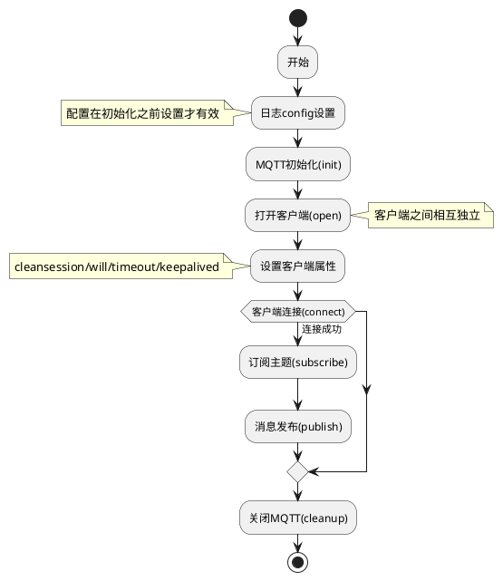

# <center>SAKURA-MQTT-SDK 开发指南</center>

## <center>v1.0.0</center>


**联系邮箱: sakuraduck@foxmail.com**


## 免责声明

Sakura7301拥有随时修改本手册的权利，内容如有更改，恕不另行通知。包括但不限于对产品特定用途适用性和适销性的隐含保证。

Sakura7301对本手册中包含的错误或对本手册的使用所带来的偶然或继起损害不承担任何责任。


| 版本 | 修改日期 | 描述 |
| :-- | :- | :- |
| v1.0.0 | 2023-06-21 | 初版发布 |


<div STYLE="page-break-after: always;"></div>

## 目录

[TOC]

<div STYLE="page-break-after: always;"></div>

## 一、SDK简介

本SDK是一个采用异步模型、高并发、跨平台的轻量级MQTT客户端，最多可以支持32个客户端同时运行。

## 二、名词解释

- MQTT：**MQTT**(**消息队列遥测传输**)是ISO 标准(ISO/IEC PRF 20922)下基于发布/订阅范式的消息协议;

## 三、快速开始

### 1. 准备工作

对于非Linux的设备需根据自身情况实现部分平台相关的功能，例如：网络连接和网络数据收、发功能、日志打印、线程互斥锁等，待实现的函数接口定义参见`sakura_user_impl.h`头文件中，开发者需完成接口实现后再进行SDK接入。

#### 1.1 开发须知

本SDK在设计上采用异步模式，对于耗时的操作，其接口调用的执行结果是通过回调函数通知到调用者的。

> - **为了确保SDK的数据一致性和执行的实效性，请不要在回调函数中执行耗时操作**。
> - 对于`Linux`系统，**请勿在回调函数中调用其他SDK接口，以防止死锁、伪超时的发生**。

### 2. 接入流程




#### 2.1 日志设置(set log)

使用接口[sakura_mqtt_set_log_config](#sakura_mqtt_set_log_config)可以对SDK的日志进行设置，包括设置日志级别、输出目标、颜色标识。
示例代码如下：

```c
sakura_sdk_log_conf_t log_conf = {0};
log_conf.level = LOG_LEVEL_INFO;
log_conf.is_color_console = SAKURA_TRUE;
log_conf.print_function = demo_log_print;
sakura_mqtt_set_log_config(&log_conf);
```

#### 2.2 SDK初始化(init)

使用接口[sakura_mqtt_init](#sakura_mqtt_init)进行MQTT初始化，初始化参数中需提供会使用到的客户端最大数量。
示例代码如下：

``` c
sakura_int32_t ret = 0;
/* 初始化4个客户端 */
ret = sakura_mqtt_init(4);
```

> 最大客户端数量为32个。大于此值将初始化失败。

#### 2.3 MQTT业务

##### 2.3.1 MQTT网络缓冲区大小设置(set net buf)

接口[sakura_mqtt_set_net_buf_size](#sakura_mqtt_set_net_buf_size)用于设置网络缓冲区大小，该接口为同步接口，需要在初始化之后调用，调用时需要传入需要设置的大小，如不设置，默认buffer大小为8192字节，设置后将使用设置后的大小。示例代码如下：

```
sakura_int32_t ret = SAKURA_MQTT_ERROR;
ret = sakura_mqtt_set_net_buf_size(4096);
if(ret = SAKURA_MQTT_STAT_OK){
    printf("set net buffer successful!\n");
}
```

##### 2.3.2 版本号获取(get version)

接口[sakura_mqtt_get_version](#sakura_mqtt_get_version)用于获取MQTT SDK版本号，可以在任何时刻调用，调用后将返回版本号字符串，示例代码如下：

```c
sakura_char_t version[32] = {0};
sprintf(version, "%s", sakura_mqtt_get_version());
DEMO_LOGD("sakura-mqtt sdk version: %s\n", version);
```

##### 2.3.3 查询MQTT属性(query)

接口[sakura_mqtt_query_properties](#sakura_mqtt_query_properties)用于查询MQTTSDK自身属性，此接口为同步接口，需要在初始化之后调用，SDK会在日志中输出当前属性信息，包括net buffer size、客户端数量等信息。示例代码如下：

```c
sakura_mqtt_query_properties();
```

##### 2.3.4 打开客户端(open)

接口[sakura_mqtt_open](#sakura_mqtt_open)用户打开一个MQTT客户端，此接口为同步接口，需要在初始化之后调用。调用时需要传递客户端id(类型为字符串)，如调用成功，返回一个可用的客户端ID，失败返回-1。示例代码如下：

```c
sakura_int32_t index_A = 0;
index_A = sakura_mqtt_open("client_A");
```

##### 2.3.5 客户端设置(set client)

接口[sakura_mqtt_set_option](#sakura_mqtt_set_option)用于设置MQTT客户端的参数，此接口为同步接口，需要在客户端打开之后进行调用，可以设置cleanSession/will/timeout/keepAlive。调用时需要传入客户端IP，设置选项以及需要设置的参数。示例代码如下：

```c
/* 1.设置遗嘱 */
mqtt_will_t will_A = {0};
will_A.qos = QOS0;
will_A.topic = "sakura/A/err";
will_A.payload = (sakura_uint8_t*)"sakura_A network failure, exited.";
will_A.retained = 0;
will_A.payloadlen = strlen((const sakura_char_t*)will_A.payload);
(sakura_void_t)sakura_mqtt_set_option(index, SAKURA_MQTT_SET_WILL, &will_A);


/* 2.设置清除会话标志 */
sakura_int32_t cleansession = 0;
(sakura_void_t)sakura_mqtt_set_option(index, SAKURA_MQTT_SET_CLEANSESSION, &cleansession);


/* 3.设置心跳间隔 */
sakura_int32_t ret = SAKURA_MQTT_ERROR;
sakura_uint32_t keepalive_interval = 30;
ret = sakura_mqtt_set_option(index, SAKURA_MQTT_SET_KEEPALIVE, &keepalive_interval);


/* 4.设置消息超时间隔 */
sakura_int32_t ret = SAKURA_MQTT_ERROR;
sakura_uint32_t timeout_interval = 30;
ret = sakura_mqtt_set_option(index, SAKURA_MQTT_SET_TIMEOUT, &timeout_interval);
```

##### 2.3.6 客户端连接(connect)

接口[sakura_mqtt_connect](#sakura_mqtt_connect)用于令指定ID的客户端发起连接。该接口为异步接口，调用时需要传入客户端ID，账户信息以及回调函数集。代码示例如下：

```c
    sakura_int32_t ret = 0;
    sakura_mqtt_account_info_t account = {0};
    sakura_sock_host_t broker = {0};
    mqtt_cbs_t  client_cbs = {
        client_on_connect,
        client_on_disconnect,
        client_on_subscribe,
        client_on_unsubscribe,
        client_on_status,
        client_on_message
    };
    broker.hostname = DEMO_TEST_HOST;
    broker.port = 1883;
    account.broker = &broker;
    account.username = NULL;
    account.password = NULL;
    ret = sakura_mqtt_connect(index, &account, &client_cbs);
```

连接的结果通过调用时注册的回调函数集中的[连接回调函数](#connect_cb)通知用户，代码实现如下：

```c
static sakura_void_t client_on_connect(sakura_int32_t index, sakura_int32_t code)
{
    sakura_char_t* topic = "your/topic";
    DEMO_LOGD("============= on_A_connect =============\n");
    DEMO_LOGD("====   client index[%2d], code = %2d  ====\n", index, code);
    if(code == SAKURA_MQTT_CONNECT_ACCEPTED){
        client_A_conn_flag = 1;
    }
}
```

<span id="sub_ret"> </span>
订阅的结果通过客户端连接时注册的回调函数集中的[订阅回调函数](#subscribe_cb)通知用户，代码实现如下：

```c
static sakura_void_t client_on_subscribe(sakura_int32_t index, const sakura_int32_t *suback_code, sakura_uint32_t code_num)
{
    sakura_uint32_t i;
    DEMO_LOGD("============ on_A_subscribe ============\n");
    for (i = 0; i < code_num; i++){
        DEMO_LOGD("===  client [%d] topic_%d code = %d\n", index, i, suback_code[i]);
    }
    client_A_sub_flag = 1;
}
```

断开连接的结果通过客户端连接时注册的回调函数集中的[断开连接回调函数](#disconnect_cb)通知用户，代码实现如下：

```c
static sakura_void_t client_on_disconnect(sakura_int32_t index, sakura_int32_t code)
{
    DEMO_LOGD("============= on_A_disconnect =============\n");
    DEMO_LOGD("====   client index[%2d], code = %2d  ====\n", index, code);
    client_A_disconnect_flag ++;
}
```

取消订阅的结果通过客户端连接时注册的回调函数集中的[取消订阅回调函数](#unsubscribe_cb)通知用户，代码实现如下：

```c
static sakura_void_t client_on_unsubscribe(sakura_int32_t index, sakura_int32_t code)
{
    DEMO_LOGD("=========== on_A_unsubscribe ===========\n");
    DEMO_LOGD("====   client index[%2d], code = %2d  ====\n", index, code);
}

```

MQTT业务运行过程中的状态码将通过客户端连接时注册的回调函数集中的[状态回调函数](#status_cb)通知用户，代码实现如下：

```c
static sakura_void_t client_on_status(sakura_int32_t index, sakura_int32_t code)
{
    DEMO_LOGD("============= on_A_status  =============\n");
    DEMO_LOGD("====   client index[%2d], code = %2d  ====\n", index, code);
}
```

MQTT业务运行过程中如果客户端收到消息将通过客户端连接时注册的回调函数集中的[消息回调函数](#message_cb)通知用户，代码实现如下：

```c
static sakura_void_t client_on_message(sakura_int32_t index, const sakura_char_t *topic, const sakura_uint8_t *msg, sakura_uint32_t msg_len)
{
    sakura_uint8_t out_buf[DEMO_BUFFER_LEN] = {0};
    DEMO_LOGD("============= on_A_message =============\n");
    DEMO_LOGD("index = %d, topic = %s, len = %d\n", index, topic, msg_len);
    memcpy(out_buf, msg, msg_len);
    DEMO_LOGD("message : %s\n", out_buf);
}
```

##### 2.3.7 客户端驱动(tick)

接口[sakura_mqtt_tick](#sakura_mqtt_tick)用于驱动所有处于服务状态的客户端运转来完成业务。此接口为同步接口，需要在初始化之后进行调用。在嵌入式环境下，需要用户手动调用sakura_mqtt_tick去驱动SDK运转。时间间隔在10ms~100ms之间，可以根据实际情况调整。理论上时间间隔越小处理速度越快，同时浪费的cpu时间片也越多，时间间隔越大的情况与之相反，一般我们会在一个无限循环中调用sakura_mqtt_tick。需要保证该函数参数tick必须单调递增的，否则SDK无法正常运行。示例代码如下：

```c
sakura_int32_t ret = 0;
ret = sakura_mqtt_tick(4);
```

> 注意：unix环境下不需要调用此接口，如强行调用，可能出现超时、死锁等不可控问题。

##### 2.3.8 客户端订阅(subscribe)

接口[sakura_mqtt_subscribe](#sakura_mqtt_subscribe)用于为一个已连接的客户端进行订阅操作。此接口为异步接口，需要在客户端连接成功后进行调用，支持一次订阅多个主题。调用时需传入客户端ID、主题列表、主题数量。代码示例如下：

```c
sakura_mqtt_topic_t sub_topic_list[2] = {0};
sakura_char_t* topic_1 = "topic/one";
sakura_char_t* topic_2 = "topic/two";
sub_topic_list[0].qos = QOS1;
sub_topic_list[0].topic = topic_1;
sub_topic_list[1].qos = QOS2;
sub_topic_list[1].topic = topic_2;
sakura_mqtt_subscribe(index, sub_topic_list, 2);   
```

订阅的结果通过客户端连接时注册的回调函数集中的[订阅回调函数](#subscribe_cb)通知用户，代码示例请参照[2.4.6](#2.4.6)章节内容。

##### 2.3.9 客户端取消订阅(unsubscribe)

接口[sakura_mqtt_unsubscribe](#sakura_mqtt_unsubscribe)用于为一个已连接的客户端取消订阅某些主题。此接口为异步接口，需要在客户端连接成功之后调用，支持一次取消多个主题。调用时需传入客户端ID、主题列表、主题数量。代码示例如下：

```c
sakura_int32_t ret = -1;
sakura_char_t* unsub_topic[2] = {0};
unsub_topic[0] = TEST_TOPIC_A;
unsub_topic[1] = TEST_TOPIC_B;
ret = sakura_mqtt_unsubscribe(1, unsub_topic, 2);
```

取消订阅的结果通过客户端连接时注册的回调函数集中的[取消订阅回调函数](#unsubscribe_cb)通知用户，代码示例请参照[2.4.6](#2.4.6)章节内容。

##### 2.3.10 客户端消息发布(publish)

接口[sakura_mqtt_publish](#sakura_mqtt_publish)用于为一个已连接的客户端进行消息发布操作。此接口为异步接口，需要在客户端连接成功之后调用。调用时需传入客户端ID、消息结构体、消息发布回调函数。代码示例如下：

```c
sakura_char_t* topic = "topic/B/message";
sakura_char_t* payload = "Hello,I am A client_A!";
mqtt_message_t message = {0};
message.qos = QOS1;
message.payloadlen = strlen(payload);
message.retained = 0;
message.id = index;
message.payload = (sakura_uint8_t*)payload;
sakura_mqtt_publish(index, topic, &message, NULL);
```

消息发布的结果将通过接口调用时注册的[消息发布回调函数](#publish_cb)通知用户，如无需通知，可以传入NULL。代码示例如下：

```c
static sakura_void_t client_on_publish(sakura_int32_t index, sakura_int32_t status_code)
{
    printf("client %d publish status code = %d\n", index, status_code);
}
```

##### 2.3.11 客户端断开连接(disconnect)

接口[sakura_mqtt_disconnect](#sakura_mqtt_disconnect)用于断开一个已连接的客户端。此接口为异步接口，需要在客户端连接成功之后调用。调用时需传入需要断开的客户端ID。示例代码如下：

```c
ret = sakura_mqtt_disconnect(index);
```

断开连接的结果通过客户端连接时注册的回调函数集中的[连接断开回调函数](#disconnect_cb)通知用户，代码示例请参照[2.4.6](#2.4.6)章节内容。

##### 2.3.12 客户端关闭(close)

接口[sakura_mqtt_close](#sakura_mqtt_close)用于关闭一个已打开的客户端。此接口为异步接口，需要在客户端已经被打开时调用。调用时需传入需要关闭的客户端ID。示例代码如下：

```c
ret = sakura_mqtt_close(index);
```

#### 2.4 SDK 清理(cleanup)

接口[sakura_mqtt_cleanup](#sakura_mqtt_cleanup)用于清理MQTT所有资源，关闭所有客户端，同时清理通用业务相关资源。需要在初始化之后调用。示例代码如下：

```c
sakura_mqtt_cleanup();
```

## 四、详细接口描述

### 1. sakura_mqtt_set_log_config

用于配置日志级别、日志输出指向，**请于MQTT初始化前调用此接口**。

#### 1.1 接口定义

```c
sakura_int32_t sakura_mqtt_set_log_config(sakura_sdk_log_conf_t* conf);
```

#### 1.2 参数说明

| 参数名 | 必填 | 参数类型 | 说明 |
| :- | :- | :- | :- |
| conf | 是 | sakura_sdk_log_conf_t | 需要配置的日志信息 |

`sakura_sdk_log_conf_t`类型定义如下：

```c
typedef sakura_int32_t (*sakura_log_print_func_t)(const sakura_char_t* log_str);
typedef struct {
    SAKURA_LOG_LEVEL level;
    sakura_bool_t is_color_console;
    sakura_log_print_func_t print_function;
} sakura_sdk_log_conf_t;
```

| 字段名 | 必填 | 字段类型 | 说明 |
| :- | :- | :- | :- |
| level | 是 | SAKURA_LOG_LEVEL | 日志级别 |
| print_function | 否 | sakura_log_print_func_t | 日志输出函数指针 |
| is_color_console | 是 | sakura_bool_t | 是否开启颜色显示 |

`SAKURA_LOG_LEVEL`类型定义如下：

```c
typedef enum {
    LOG_LEVEL_NONE = 0,
    LOG_LEVEL_FATAL,
    LOG_LEVEL_ERROR,
    LOG_LEVEL_WARNING,
    LOG_LEVEL_INFO,
    LOG_LEVEL_DEBUG,
    LOG_LEVEL_VERBOSE,
} SAKURA_LOG_LEVEL;
```

| 字段名 | 必填 | 字段类型 | 说明 |
| :- | :- | :- | :- |
| LOG_LEVEL_NONE | 否 | enum | 无日志输出 |
| LOG_LEVEL_FATAL | 否 | enum | 严重错误信息 |
| LOG_LEVEL_ERROR | 否 | enum | 错误日志信息 |
| LOG_LEVEL_WARNING | 否 | enum | 警告日志信息 |
| LOG_LEVEL_INFO | 否 | enum | 一般日志信息 |
| LOG_LEVEL_DEBUG | 否 | enum | 调试日志信息 |
| LOG_LEVEL_VERBOSE | 否 | enum | 详细日志信息(所有) |

`sakura_log_print_func_t`类型定义如下：

```c
typedef sakura_int32_t (*sakura_log_print_func_t)(const sakura_char_t* log_str);
```

| 字段名 | 必填 | 字段类型 | 说明 |
| :- | :- | :- | :- |
| log_str | 是 | const sakura_char_t* | 日志字符串 |

#### 1.3 返回值说明

| 状态码 | 值 | 说明 |
| :- | :- | :- |
| SAKURA_MQTT_STAT_OK | 0 | 设置成功 |
| SAKURA_MQTT_ERR_INVALID_ARGS | -3    | 无效参数             |
| 其他 | < 0 | 请参考第五章节错误码定义 |

### 2. sakura_mqtt_init

用于初始化MQTT模块。

#### 2.1 接口定义

```c
sakura_int32_t sakura_mqtt_init(sakura_uint32_t c_max_num);
```

#### 2.2 参数说明

| 参数名 | 必填 | 参数类型 | 说明 |
| :- | :- | :- | :- |
| c_max_num | 是 | sakura_uint32_t |需要初始化的客户端数量 |

#### 2.3 返回值说明

| 状态码           | 值   | 说明                     |
| :----------- | :------------------------- | :------------------------------- |
| SAKURA_MQTT_STAT_OK | 0           | 初始化成功                       |
| SAKURA_MQTT_ERR_INVALID_ARGS | -3 | 无效参数 |
| SAKURA_MQTT_ERR_REQ_IGN | -5 | 操作被忽略，调用流程存在问题 |
| SAKURA_MQTT_ERR_INITIALIZED  | -6 | 操作被忽略，SDK已初始化 |
| SAKURA_MQTT_ERR_MEMORY | -2 | 动态申请内存失败 |
| 其他 | < 0  | 请参考第五章节错误码定义 |

### 3. sakura_mqtt_set_net_buf_size

设置客户端的send/recv/backup缓冲区大小。

#### 3.1 接口定义

```c
sakura_int32_t sakura_mqtt_set_net_buf_size(sakura_uint32_t size);
```

#### 3.2 参数说明

| 参数名 | 必填 | 参数类型 | 说明 |
| :- | :- | :- | :- |
| size | 是 | sakura_uint32_t |需要设置的缓冲区大小 |

#### 3.3 返回值说明

| 状态码           | 值   | 说明                     |
| :----------- | :------------------------- | :------------------------------- |
| SAKURA_MQTT_STAT_OK | 0           | 设置成功                       |
| SAKURA_MQTT_ERROR | -1 | 接口调用失败 |

### 4. sakura_mqtt_get_version

获取SAKURA-MQTT-SDK版本号。


#### 4.1 接口定义

```c
const sakura_char_t* sakura_mqtt_get_version(sakura_void_t);
```

#### 4.2 参数说明

无。

#### 4.3 返回值说明

| 返回值类型 | 说明 |
| :-- | :- |
| const sakura_char_t* | 当前版本号 |

### 5. sakura_mqtt_query_properties

查询已设置的MQTT属性。


#### 5.1 接口定义

```c
sakura_int32_t sakura_mqtt_query_properties(sakura_void_t);
```

打印已设置的MQTT信息，客户端数量、net buffer size等。

#### 5.2 参数说明

无。

#### 5.3 返回值说明

| 返回值类型 | 值 | 说明 |
| -- | :-: | :- |
| sakura_int32_t | 0 | 调用结果 |

### 6. sakura_mqtt_open

打开一个客户端。

#### 6.1 接口定义

```c
sakura_int32_t sakura_mqtt_open(const sakura_char_t *client_id);
```

#### 6.2 参数说明

| 参数名 | 必填 | 参数类型 | 说明 |
| :- | :- | :- | :- |
| client_id | 是 | const sakura_char_t * | 客户端id |

#### 6.3 返回值说明

| 状态码           | 值   | 说明                     |
| :- | :- | :- |
| SAKURA_MQTT_STAT_OK | >=0 | 可用的客户端索引 |
| SAKURA_MQTT_ERR_MEMORY | -2 | 动态申请内存失败 |
| SAKURA_MQTT_ERROR | -1 | 接口调用失败 |

### 7.sakura_mqtt_close

关闭一个已打开的客户端。

#### 7.1 接口定义

```c
sakura_int32_t sakura_mqtt_close(sakura_int32_t index);
```

#### 7.2 参数说明

| 参数名 | 必填 | 参数类型 | 说明 |
| :- | :- | :- | :- |
| index | 是 | sakura_int32_t | 客户端索引 |

#### 7.3 返回值说明

| 状态码           | 值   | 说明                     |
| :- | :- | :- |
| SAKURA_MQTT_STAT_OK | 0    | 关闭客户端成功             |
| SAKURA_MQTT_ERROR | -1 | 接口调用失败 |
| SAKURA_MQTT_ERR_INVALID_ARGS | -3 | 无效的参数 |

### 8. sakura_mqtt_set_option

设置客户端属性。

#### 8.1 接口定义

```c
sakura_int32_t sakura_mqtt_set_option(sakura_int32_t index, SAKURA_MQTT_OPT opt, sakura_void_t *arg);
```

#### 8.2 参数说明

| 参数名 | 必填 | 参数类型 | 说明 |
| :- | :- | :- | :- |
| index | 是 | sakura_int32_t | 客户端索引 |
| opt | 是 | SAKURA_MQTT_OPT | 枚举类型，用于标识需要设置的配置项 |
| arg | 是 | sakura_void_t* | 指向配置项值的指针，类型由opt决定 |

`opt`取值和`arg`类型的对饮关系如下表：

| type取值 | conf类型 | 备注 |
| :-- | :-- | :-- |
| SAKURA_MQTT_SET_WILL | mqtt_will_t* | 遗嘱消息结构体指针 |
| SAKURA_MQTT_SET_KEEPALIVE | sakura_uint32_t | 需要设置的心跳间隔(变量) |
| SAKURA_MQTT_SET_CLEANSESSION | sakura_uint32_t | 是否清除会话(变量) |
| SAKURA_MQTT_SET_TIMEOUT | sakura_uint32_t | 需要设置的消息超时时限(变量) |

`mqtt_will_t`类型定义如下：

```c
typedef struct
{
    QoS                                   qos;
    sakura_uint8_t                        retained;
    sakura_char_t                         *topic;
    sakura_uint8_t                        *payload;
    sakura_uint32_t                       payloadlen;
} mqtt_will_t;
````

| 字段名 | 必填 | 字段类型 | 说明 |
| :- | :- | :- | :- |
| qos | 是 | QoS | 消息级别，枚举类型 |
| retained | 是 | sakura_uint8_t | 消息保留标志 |
| topic | 是 | sakura_char_t* | 遗嘱消息主题 |
| payload | 是 | sakura_uint8_t* | 遗嘱消息内容 |
| payloadlen | 是 | sakura_uint32_t| 遗嘱消息长度 |

`QOS`类型定义如下：

```c
typedef enum
{
    QOS0 = 0x00,    	/* 消息传输级别：0(最多一次) */
    QOS1,           	/* 消息传输级别：1(最少一次) */
    QOS2,           	/* 消息传输级别：2(只有一次) */
    SUBFAIL=0x80    	/* 订阅失败 */
} QoS;
```

#### 8.3 返回值说明

| 状态码           | 值   | 说明                     |
| :- | :- | :- |
| SAKURA_MQTT_STAT_OK | 0    | 设置客户端属性成功 |
| SAKURA_MQTT_ERROR | -1 | 接口调用失败 |
| SAKURA_MQTT_ERR_REQ_IGN | -5 | 操作被忽略，调用流程存在问题 |
| SAKURA_MQTT_ERR_INVALID_ARGS | -3 | 无效的参数 |

### 9. sakura_mqtt_set_async_tick_rate

在嵌入式环境下，需要用户手动调用sakura_mqtt_set_async_tick_rate去设置tick的频率。

#### 9.1 接口定义

```c
sakura_int32_t sakura_mqtt_set_async_tick_rate(sakura_uint32_t tick_rate);
```

#### 9.2 参数说明

| 参数名 | 必填 | 参数类型 | 说明 |
| :- | :- | :- | :- |
| tick_rate | 是 | sakura_uint32_t | tick调用频率,单位HZ |

#### 9.2 返回值说明

| 状态码           | 值   | 说明                     |
| :- | :- | :- |
| SAKURA_MQTT_STAT_OK | 0    | 设置成功 |
| SAKURA_MQTT_ERROR | -1 | 接口调用失败 |

### 10. sakura_mqtt_tick

在嵌入式环境下，需要用户手动调用sakura_mqtt_tick去驱动SDK运转。时间间隔在10ms~100ms之间，可以根据实际情况调整。理论上时间间隔越小处理速度越快，同时浪费的cpu时间片也越多，时间间隔越大的情况与之相反，一般我们会在一个无限循环中调用sakura_mqtt_tick。需要保证该函数参数tick必须单调递增的，否则SDK无法正常运行。

#### 10.1 接口定义

```c
sakura_int32_t sakura_mqtt_tick(sakura_uint64_t tick);
```

#### 10.2 参数说明

| 参数名 | 必填 | 参数类型 | 说明 |
| :- | :- | :- | :- |
| tick | 是 | sakura_uint64_t | 单调递增的时间，单位秒 |

#### 10.3 返回值说明

| 状态码           | 值   | 说明                     |
| :- | :- | :- |
| SAKURA_MQTT_STAT_OK | 0    | 调用成功 |
| SAKURA_MQTT_ALL_CLIENTS_IDLE | 105 | 没有处于服务中的客户端 |
| 其他 | < 0  | 请参考第五章节错误码定义 |

### 11. sakura_mqtt_connect

为一个已打开的客户端执行连接操作，连接的结果将通过[连接回调函数](#connect_cb)通知用户。

#### 11.1 接口定义

```c
sakura_int32_t sakura_mqtt_connect(sakura_int32_t index, const sakura_mqtt_account_info_t *account_info, const mqtt_cbs_t *cbs);
```

#### 11.2 参数说明

| 参数名 | 必填 | 参数类型 | 说明 |
| :- | :- | :- | :- |
| index | 是 | sakura_int32_t | 客户端索引 |
| account_info | 是 | sakura_mqtt_account_info_t* | 账户信息 |
| cbs | 是 | const mqtt_cbs_t* | 回调函数集 |

`sakura_mqtt_account_info_t`类型定义如下：


```c
typedef struct {
    const sakura_char_t *hostname;
    sakura_uint16_t port;
} sakura_sock_host_t;

typedef struct
{
    sakura_sock_host_t                    *broker;
    sakura_char_t                         *username;
    sakura_char_t                         *password;
} sakura_mqtt_account_info_t;

```

| 参数名 | 必填 | 参数类型 | 说明 |
| :- | :- | :- | :- |
| broker | 是 | sakura_sock_host_t* | broker信息 |
| username | 否 | sakura_char_t* | 用户名(可选) |
| password | 否 | sakura_char_t* | 密码(可选) |
| hostname | 是 | const sakura_char_t* | 域名/ip |
| port | 是 | sakura_uint16_t | 端口 |

`CONNECT_TY`mqtt_cbs_t`类型定义如下：

```c
typedef struct
{
    mqtt_async_callback_t               cb_connect;
    mqtt_async_callback_t               cb_disconnect;
    mqtt_async_sub_callback_t           cb_subscribe;
    mqtt_async_callback_t               cb_unsubscribe;
    mqtt_async_callback_t               cb_status;
    mqtt_message_handler_t              cb_msg;
} mqtt_cbs_t;
```

| 参数名 | 必填 | 参数类型 | 说明 |
| :- | :- | :- | :- |
| cb_connect | 是 | mqtt_async_callback_t | 连接回调函数 |
| cb_disconnect | 是 | mqtt_async_callback_t | 断开连接回调函数 |
| cb_subscribe | 是 | mqtt_async_sub_callback_t | 订阅回调函数 |
| cb_unsubscribe | 是 | mqtt_async_callback_t | 取消订阅回调函数 |
| cb_status | 是 | mqtt_async_callback_t | 状态码回调函数 |
| cb_msg | 是 | mqtt_message_handler_t | 消息回调函数 |

`mqtt_async_callback_t`类型定义如下：

```c
typedef sakura_void_t (*mqtt_async_callback_t)(sakura_int32_t index, sakura_int32_t status_code);
```

| 参数名 | 必填 | 参数类型 | 说明 |
| :- | :- | :- | :- |
| index | 是 | sakura_int32_t | 客户端索引 |
| status_code | 是 | sakura_int32_t | 状态码 |

`mqtt_async_sub_callback_t`类型定义如下：

```c
typedef sakura_void_t (*mqtt_async_sub_callback_t)(sakura_int32_t index, const sakura_int32_t *suback_code, sakura_uint32_t code_num);
```

| 参数名 | 必填 | 参数类型 | 说明 |
| :- | :- | :- | :- |
| index | 是 | sakura_int32_t | 客户端索引 |
| status_code | 是 | const sakura_int32_t* | 订阅返回码数组 |
| code_num | 是 | sakura_uint32_t | 返回码数量 |

`mqtt_message_handler_t`类型定义如下：

```c
typedef sakura_void_t (*mqtt_message_handler_t)(sakura_int32_t index, const sakura_char_t *topic, const sakura_uint8_t *message, sakura_uint32_t message_len);
```

| 参数名 | 必填 | 参数类型 | 说明 |
| :- | :- | :- | :- |
| index | 是 | sakura_int32_t | 客户端索引 |
| topic | 是 | const sakura_char_t* | 主题 |
| message | 是 | const sakura_uint8_t* | 消息体 |
| message_len | 是 | sakura_uint32_t | 消息长度 |

#### 11.3 返回值说明

| 状态码           | 值   | 说明                     |
| :- | :- | :- |
| SAKURA_MQTT_STAT_OK | 0    | 接口调用成功             |
| SAKURA_MQTT_ERR_INVALID_ARGS | -3 | 无效的参数 |
| SAKURA_MQTT_ERR_REQ_IGN | -5 | 操作被忽略，调用流程存在问题 |
| 其他 | < 0  | 请参考第五章节错误码定义 |

### 12. sakura_mqtt_disconnect

为一个已连接的客户端执行断开连接操作，断开连接的结果将通过[断开连接回调函数](#disconnect_cb)通知用户。

#### 12.1 接口定义

```c
sakura_int32_t sakura_mqtt_disconnect(sakura_int32_t index);
```

#### 12.2 参数说明

| 参数名 | 必填 | 参数类型 | 说明 |
| :- | :- | :- | :- |
| index | 是 | sakura_int32_t | 客户端索引 |

#### 12.3 返回值说明

| 状态码           | 值   | 说明                     |
| :- | :- | :- |
| SAKURA_MQTT_STAT_OK | 0    | 接口调用成功             |
| SAKURA_MQTT_ERR_INVALID_ARGS | -3 | 无效的参数 |
| SAKURA_MQTT_ERR_REQ_IGN | -5 | 操作被忽略，调用流程存在问题 |
| 其他 | < 0  | 请参考第五章节错误码定义 |

### 12. sakura_mqtt_subscribe

为一个已连接的客户端订阅主题，订阅的结果将通过[订阅回调函数](#subscribe_cb)通知用户。

#### 12.1 接口定义

```c
sakura_int32_t sakura_mqtt_subscribe(sakura_int32_t index, const sakura_mqtt_topic_t *sub_topic_list, sakura_uint32_t topic_num);
```

#### 12.2 参数说明

| 参数名 | 必填 | 参数类型 | 说明 |
| :- | :- | :- | :- |
| index | 是 | sakura_int32_t | 客户端索引 |
| sub_topic_list | 是 | sakura_mqtt_topic_t* | 需要订阅的主题列表，类型为结构体数组 |
| topic_num | 是 | sakura_uint32_t | 主题数量 |

`sakura_mqtt_topic_t`类型定义如下：

```c
typedef struct
{
    QoS                                 qos;
    const sakura_char_t                   *topic;
} sakura_mqtt_topic_t;
```

#### 12.3 返回值说明

| 状态码           | 值   | 说明                     |
| :- | :- | :- |
| SAKURA_MQTT_STAT_OK | 0    | 接口调用成功             |
| SAKURA_MQTT_ERR_INVALID_ARGS | -3 | 无效的参数 |
| SAKURA_MQTT_ERR_REQ_IGN | -5 | 操作被忽略，调用流程存在问题 |
| 其他 | < 0  | 请参考第五章节错误码定义 |

### 13. sakura_mqtt_unsubscribe

为一个已连接的客户端取消订阅某些主题，订阅的结果将通过[取消订阅回调函数](#unsubscribe_cb)通知用户。

#### 13.1 接口定义

```c
sakura_int32_t sakura_mqtt_unsubscribe(sakura_int32_t index, const sakura_char_t *unsub_topic_list[], sakura_uint32_t topic_num);
```

#### 13.2 参数说明

| 参数名 | 必填 | 参数类型 | 说明 |
| :- | :- | :- | :- |
| index | 是 | sakura_int32_t | 客户端索引 |
| unsub_topic_list | 是 | const sakura_char_t* | 需要取消订阅的主题数组 |
| topic_num | 是 | sakura_uint32_t | 主题数量 |

#### 13.3 返回值说明

| 状态码           | 值   | 说明                     |
| :- | :- | :- |
| SAKURA_MQTT_STAT_OK | 0    | 接口调用成功             |
| SAKURA_MQTT_ERR_INVALID_ARGS | -3 | 无效的参数 |
| SAKURA_MQTT_ERR_REQ_IGN | -5 | 操作被忽略，调用流程存在问题 |
| 其他 | < 0  | 请参考第五章节错误码定义 |

### 14. sakura_mqtt_publish

为一个已连接的客户端执行消息发布操作，订阅的结果将通过接口调用时注册的[消息发布回调函数](#message_cb)通知用户。

#### 14.1 接口定义

```c
sakura_int32_t sakura_mqtt_publish(sakura_int32_t index, const sakura_char_t *topic, const mqtt_message_t *message, mqtt_async_callback_t pub_cb);
```

#### 14.2 参数说明

| 参数名 | 必填 | 参数类型 | 说明 |
| :- | :- | :- | :- |
| index | 是 | sakura_int32_t | 客户端索引 |
| topic | 是 | const sakura_char_t* | 主题 |
| message | 是 | const mqtt_message_t* | 消息结构体 |
| pub_cb | 是 | mqtt_async_callback_t | 发布回调 |

`mqtt_message_t`类型定义如下：

```c
typedef struct
{
    QoS                                 qos;
    sakura_uint8_t                        retained;
    sakura_uint8_t                        dup;
    sakura_uint16_t                       id;
    sakura_uint8_t                        *payload;
    sakura_uint32_t                       payloadlen;
} mqtt_message_t;
```

| 参数名 | 必填 | 参数类型 | 说明 |
| :- | :- | :- | :- |
| qos | 是 | sakura_int32_t | 消息级别 |
| retained | 是 | sakura_uint8_t | 消息保留标志 |
| dup | 是 | sakura_uint8_t | 消息重复标志 |
| id | 是 | sakura_uint16_t | 消息流水号 |
| payload | 是 | sakura_uint8_t* | 消息负载 |
| payloadlen | 是 | sakura_uint32_t | 消息负载长度 |

#### 14.3 返回值说明

| 状态码           | 值   | 说明                     |
| :- | :- | :- |
| SAKURA_MQTT_STAT_OK | 0    | 接口调用成功             |
| SAKURA_MQTT_ERR_INVALID_ARGS | -3 | 无效的参数 |
| SAKURA_MQTT_ERR_REQ_IGN | -5 | 操作被忽略，调用流程存在问题 |
| 其他 | < 0  | 请参考第五章节错误码定义 |

### 15. sakura_mqtt_cleanup

清理MQTT资源，关闭所有客户端。

#### 15.1 接口定义

```c
sakura_void_t sakura_mqtt_cleanup(sakura_void_t);
```

#### 15.2 参数说明

无。

#### 15.3 返回值说明

无。

## 五、常见错误码和状态码定义

下面是SAKURA-MQTT-SDK常见错误码定义，其中部分错误码和状态码跟具体业务场景相关，请结合自身业务和调用的接口进行匹配。

### 状态码描述表

| 状态码                                          | 值     | 说明                                                         |
| ----------------------------------------------- | ------ | ------------------------------------------------------------ |
| SAKURA_MQTT_STAT_OK                         | 0 | 接口调用成功 |
| SAKURA_MQTT_ALL_CLIENTS_IDLE                | 105 | 所有客户端都是空闲的 |
| SAKURA_MQTT_CONNECT_ACCEPTED                | 201 | MQTT客户端连接成功 |
| SAKURA_MQTT_CONNECT_DISCONNECTED            | 210 | MQTT客户端断开连接成功 |
| SAKURA_MQTT_SUBACK_QOS0_SUCCESS             | 300 | 消息级别为0的主题订阅成功 |
| SAKURA_MQTT_SUBACK_QOS0_SUCCESS             | 301 | 消息级别为1的主题订阅成功 |
| SAKURA_MQTT_SUBACK_QOS0_SUCCESS             | 302 | 消息级别为2的主题订阅成功 |
| SAKURA_MQTT_UNSUBSCRIBE_SUCCESS             | 401 | 取消订阅成功 |
| SAKURA_DFILE_COMPLETE                       | 501 | 文件下载完成 |
| SAKURA_DFILE_IN_PROGRESS                    | 502 | 文件下载中 |


### 错误码描述表
| 错误码                                          | 值     | 说明                                                         |
| ----------------------------------------------- | ------ | ------------------------------------------------------------ |
| SAKURA_MQTT_ERROR                           | -1 | 接口调用失败 |
| SAKURA_MQTT_ERR_MEMORY                      | -2 | 动态内存申请失败 |
| SAKURA_MQTT_ERR_INVALID_ARGS                | -3 | 无效的参数 |
| SAKURA_MQTT_ERR_BUSY                        | -4 | 处理中，请勿重复调用 |
| SAKURA_MQTT_ERR_REQ_IGN                     | -5 | 操作被忽略，调用流程存在问题 |
| SAKURA_MQTT_ERR_INITIALIZED                 | -6 | 操作被忽略，SDK已初始化 |
| SAKURA_MQTT_NETWORK_ERROR                   | -101 | 网络异常 |
| SAKURA_MQTT_CONNECT_PROTOCOL_NONSUPPORT     | -201 | 不支持的协议版本 |
| SAKURA_MQTT_CONNECT_INVALID_CLIENT_ID       | -202 | 无效的客户端ID |
| SAKURA_MQTT_CONNECT_INVALID_SERVER          | -203 | 无效的服务器 |
| SAKURA_MQTT_CONNECT_INVALID_ACCOUNT         | -204 | 无效的账户信息 |
| SAKURA_MQTT_CONNECT_INVALID_UNAUTHORIZED    | -205 | 连接未被授权 |
| SAKURA_MQTT_CONNECT_UNKNOWN_CONNACK         | -255 | 未知的应答 |
| SAKURA_MQTT_SUBACK_FAILURE                  | -301 | 已收到应答，订阅失败 |
| SAKURA_MQTT_SUB_UNCONNECTED                 | -303 | 订阅失败，连接尚未建立 |
| SAKURA_MQTT_SUBACK_UNKNOWN_SUBACK           | -355 | 订阅失败，未知的应答 |

## 六、 使用限制说明

- 在支持多线程的平台上请勿在任何回调函数中调用接口函数，否则可能会造成线程死锁。
- 请勿在任何回调函数中添加耗时操作，否则可能会导致SDK无法正常工作。
- 请勿使用pthread_cancel函数终止调用SDK接口函数的线程，否则可能会造成线程死锁。

## 七、常见问题

### 1.cleanup的顺序

SDK对cleanup的顺序没有要求，但在调用cleanup接口后无法再调用业务接口，直至重新初始化。

### 2. 是否需要使用多线程

在Linux平台上，SDK会默认启动一个后台线程来完成网络通信等耗时操作。SDK提供的接口均为非阻塞接口，因此不建议在多线程中调用SDK接口，会增加死锁和数据竞争的风险。

而在嵌入式平台下，如果您无法使用系统接口，那么您只能单线程使用此程序(因为无法对诸多的嵌入式平台适配互斥锁，因此多线程调用将是极其危险的)。

### 3. 如何重置SDK

调用`sakura_mqtt_cleanup`接口后再调用`sakura_mqtt_init`接口即可。

### 4.客户端连接成功之后断网了怎么办？

如果客户端已经与broker建立MQTT连接，之后如果出现断网，sdk会先上报`-101`状态码，然后等待3秒之后发起重连。上一次会话中订阅的主题也会被重新订阅。
